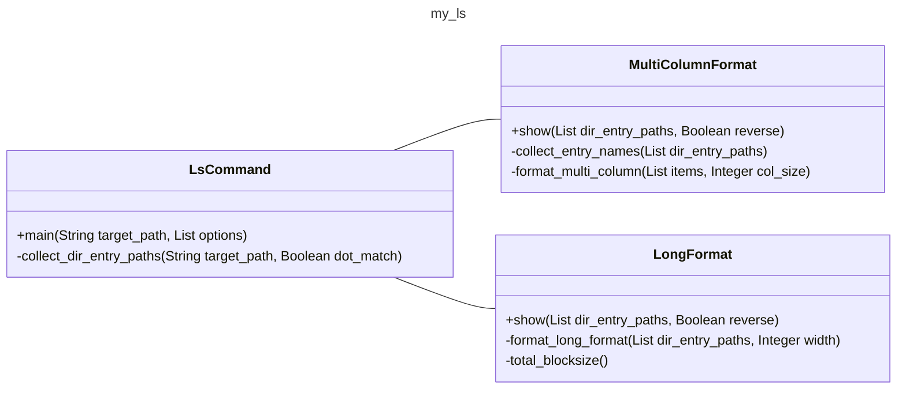

```mermaid
---
title: my_ls
---

classDiagram
    direction LR
    LsCommand -- MultiColumnFormat
    LsCommand -- LongFormat

    class LsCommand{
      +main(String target_path, List options)
      -collect_dir_entry_paths(String target_path, Boolean dot_match)
    }
    class MultiColumnFormat{
      +show(List dir_entry_paths, Boolean reverse)
      -collect_entry_names(List dir_entry_paths)
      -format_multi_column(List items, Integer col_size)
    }
    class LongFormat{
      +show(List dir_entry_paths, Boolean reverse)
      -format_long_format(List dir_entry_paths, Integer width)
      -total_blocksize()
    }

```
