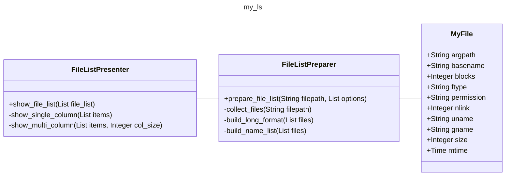

```mermaid
---
title: my_ls
---

classDiagram
    direction LR
    FileListPresenter -- FileListPreparer
    FileListPreparer -- MyFile
    class FileListPresenter{
      +show_file_list(List file_list)
      -show_single_column(List items)
      -show_multi_column(List items, Integer col_size)
    }
    class FileListPreparer{
      +prepare_file_list(String filepath, List options)
      -collect_files(String filepath)
      -build_long_format(List files)
      -build_name_list(List files)
    }
    class MyFile{
      +String argpath
      +String basename
      +Integer blocks
      +String ftype
      +String permission
      +Integer nlink
      +String uname
      +String gname
      +Integer size
      +Time mtime
    }
```
