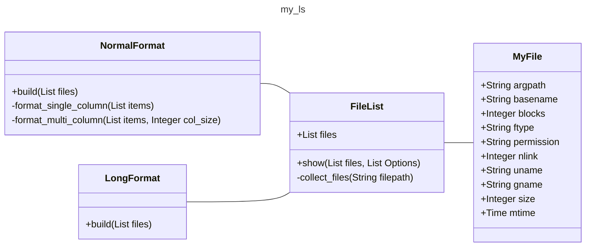

```mermaid
---
title: my_ls
---

classDiagram
    direction LR
    NormalFormat -- FileList
    LongFormat -- FileList
    FileList -- MyFile
    class NormalFormat{
      +build(List files)
      -format_single_column(List items)
      -format_multi_column(List items, Integer col_size)
    }
    class LongFormat{
      +build(List files)
    }
    class FileList{
      +List files
      +show(List files, List Options)
      -collect_files(String filepath)
    }
    class MyFile{
      +String argpath
      +String basename
      +Integer blocks
      +String ftype
      +String permission
      +Integer nlink
      +String uname
      +String gname
      +Integer size
      +Time mtime
    }
```
