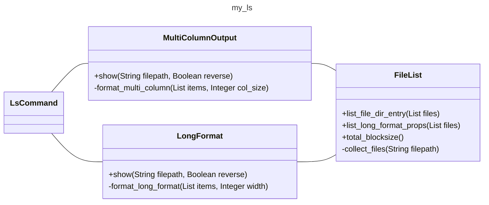

```mermaid
---
title: my_ls
---

classDiagram
    direction LR
    LsCommand -- MultiColumnOutput
    LsCommand -- LongFormat
    MultiColumnOutput -- FileList
    LongFormat -- FileList

    class MultiColumnOutput{
      +show(String filepath, Boolean reverse)
      -format_multi_column(List items, Integer col_size)
    }
    class LongFormat{
      +show(String filepath, Boolean reverse)
      -format_long_format(List items, Integer width)
    }
    class FileList{
      +list_file_dir_entry(List files)
      +list_long_format_props(List files)
      +total_blocksize()
      -collect_files(String filepath)
    }

```
