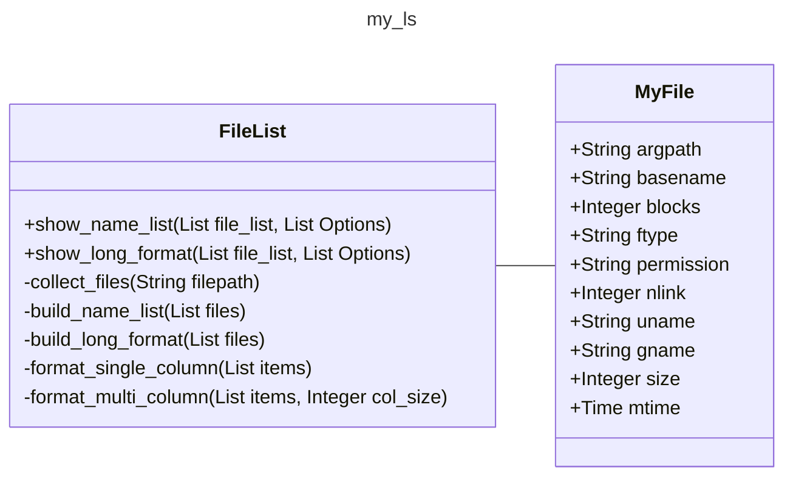

```mermaid
---
title: my_ls
---

classDiagram
    direction LR
    FileList -- MyFile
    class FileList{
      +show_name_list(List file_list, List Options)
      +show_long_format(List file_list, List Options)
      -collect_files(String filepath)
      -build_name_list(List files)
      -build_long_format(List files)
      -format_single_column(List items)
      -format_multi_column(List items, Integer col_size)
    }
    class MyFile{
      +String argpath
      +String basename
      +Integer blocks
      +String ftype
      +String permission
      +Integer nlink
      +String uname
      +String gname
      +Integer size
      +Time mtime
    }
```
